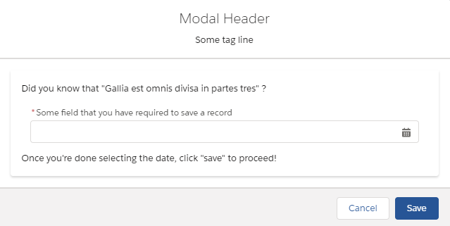

# Lightning Web Component Modal

An example of how to implement a composable modal LWC, which can be used in any project.

## Modal Usage

Included in this repository is the `modal` as well as an example `modal_wrapper` component that hooks into the `modal`. The modal utilizes the following slots/properties to dynamically show content (properties are annotated typescript-style, where a question mark indicates that the property is optional) :

-   (property - `string?`) `modal-header` : use to display a title for your modal
-   (property - `string?`) `modal-tagline` : use to display a subtitle for your modal
-   (property - `function?`) `modalSaveHandler` can be passed to the modal to display a save button. Injecting this function into the modal _requires_ the use of a fat-arrow function, as demonstrated in the `modal_wrapper` example
-   (slot - name = "body") this slot is to be used for any and all LWC content that is to be "hidden" and marked inaccessible when the modal is open
-   (slot - name = "modalContent") this slot is used to inject markup into the body of the modal. In the `modal_wrapper` example, I use a date-type `lightning-input`, as well as some text, to demonstrate
-   (public method) `toggleModal` - the `modal_wrapper` example makes use of a button whose `onclick` method calls the modal to open it

## What Does It End Up Looking Like?

This is what the `modal_wrapper` component looks like when added to a flexipage:

## Accessibility

As much as possible, this modal attempts to adhere to the guidelines set down for modals in the [Lightning Design System](https://www.lightningdesignsystem.com/components/modals/#Accessibility):

> Modals, by definition, trap focus. This means that if a user presses Tab or Shift+Tab while their keyboard focus is in the modal, their focus should stay in and cycle through the modal’s content. Focus shouldn’t return to the underlying page until the user presses the Esc key, presses an explicit “Cancel” or “Close” button in the modal, or performs another action that closes the modal.

One active issue with trapping focus in the modal at present is with the injected elements; in theory, you should be able to use append the `focusable` class to all focusable elements that are part of the `modalContent` slot; however, in practice, the LWC shadow DOM (and Web Components in general) do not support the detection of focused elements that are injected by slot. I have [filed a Github issue with the LWC team](https://github.com/salesforce/lwc/issues/1923) in the hopes of resolving this. For now, this means that only the cancel/save buttons have "trapped" focus within the modal. Focus is still trapped; it's just limited to those buttons for now.

Additionally, this modal meets all of the criteria for the [LDS's expected keyboard interactions](https://www.lightningdesignsystem.com/components/modals/#Expected-keyboard-interactions):

> -   Esc key closes the modal and moves focus to whatever triggered the modal to open
> -   Tab key at bottom of modal cycles focus back to first focusable element at top of modal
> -   Shift+Tab keys at top of modal cycle focus back to last focusable element at bottom of modal
> -   Enter key submits modal’s form data, if applicable
> -   Clicking outside of the modal closes the modal

## Closing

In practice, the use of a modal is either to display optional information (in which case the `modalSaveHandler` function is unnecessary; you only need to give people options for how to close the modal), or to block progress until a form/required fields are filled out. Either way, this modal recipe gives you everything you need to succeed!
